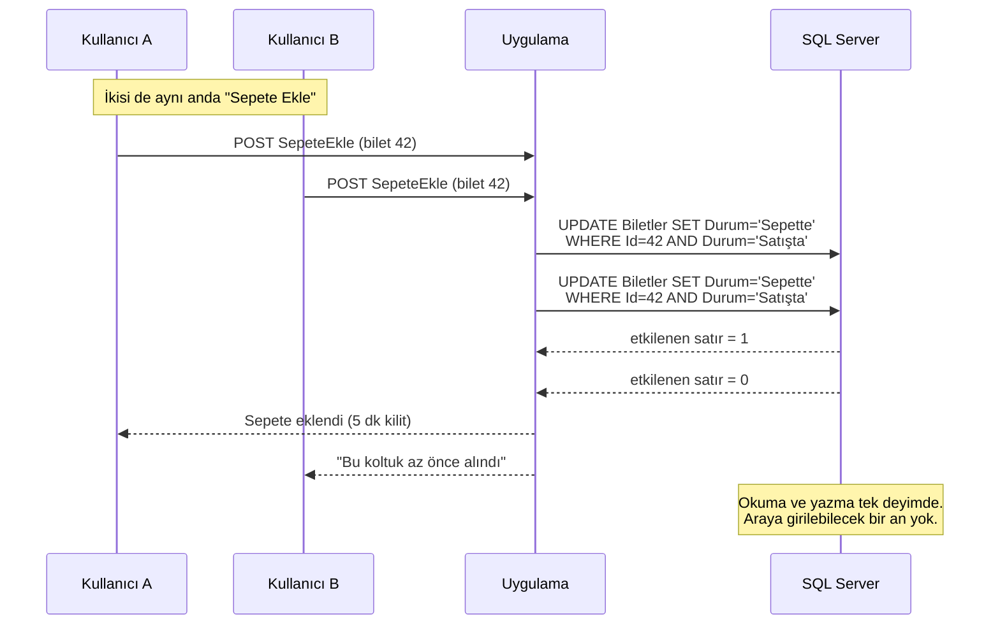
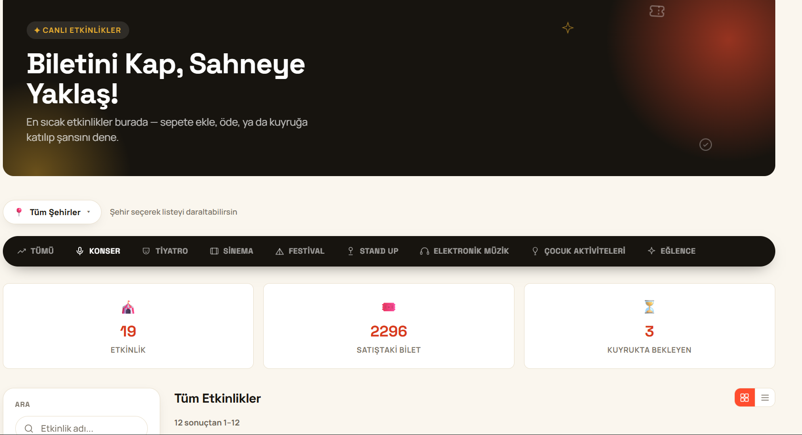
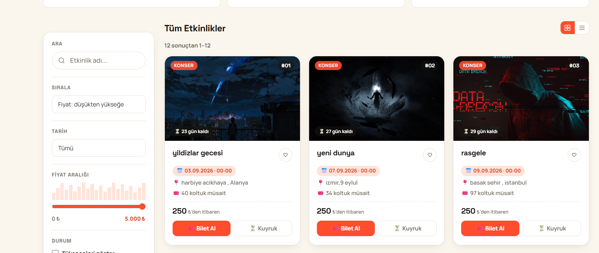
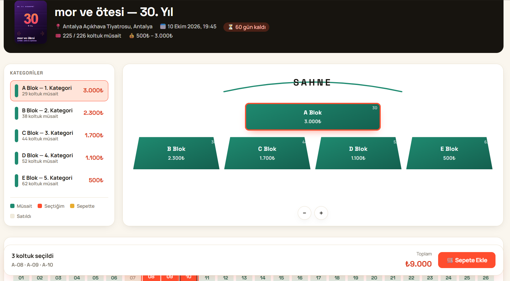
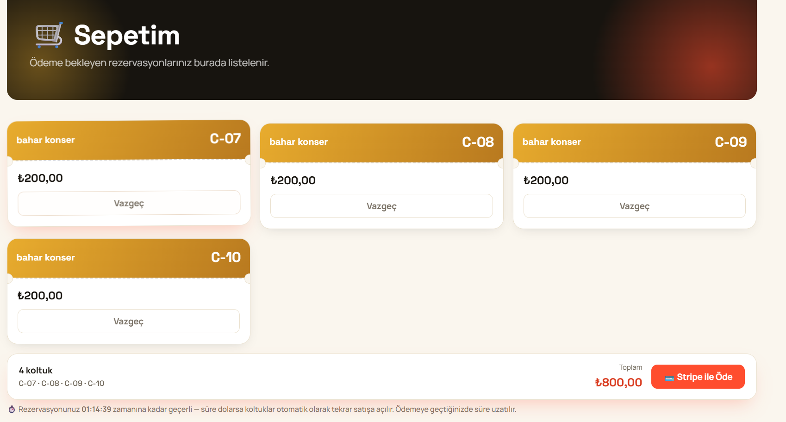
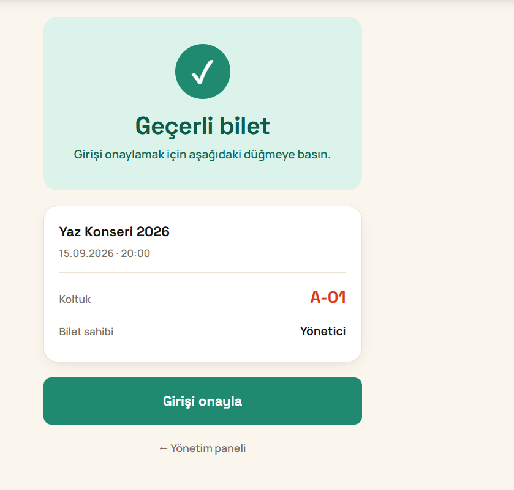
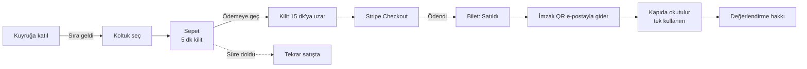

# 🎟️ BiletSatış

[](https://github.com/Osama534-png/BiletSatis-/actions/workflows/ci.yml)


**Aynı bileti aynı anda 200 kişi isterse ne olur?** Bu proje o soruya kod yazarak değil, **ölçerek** cevap veriyor.

Gerçek bir ödeme sağlayıcısına bağlı bir bilet satış sistemi: ASP.NET Core MVC + EF Core + SQL Server. Klasik "sepete ekle / satın al" akışının **race condition** problemini SQL Server seviyesinde atomik sorgularla çözer, adil bir **bekleme kuyruğu** işletir ve biletleri **imzalı QR** ile kapıda doğrular.

Ayırt edici yanı özellik listesi değil, iddiaların ölçülmüş olması. "Race condition'a karşı korumalı" cümlesi tek başına hiçbir şey ifade etmez; aşağıdaki her satır çalıştırılabilir bir testin çıktısıdır.

---

### Nereden başlamalı?

| Ne aradığınıza göre | Gidin |
|---|---|
| **Mühendislik kalitesini görmek istiyorum** | [Mimari Kararlar](#mimari-kararlar) — her kararın gerekçesi ve reddedilen alternatifi |
| **İddialar doğru mu?** | [Ölçülmüş sonuçlar](#ölçülmüş-sonuçlar) · [Beş dakikada doğrulayın](#beş-dakikada-kendiniz-doğrulayın) |
| **Hata bulup düzeltebiliyor mu?** | [Kendi kodunu denetlemek](#kendi-kodunu-denetlemek) — bulunan 12 hata ve kanıtları |
| **Çalıştırmak istiyorum** | [Kurulum](#kurulum) · [Docker ile](#docker-ile-çalıştırma) |
| **Ne yapmıyor?** | [Bilinen kapsam dışı konular](#bilinen-kapsam-dışı-konular) |

<details>
<summary><b>Tüm içindekiler</b></summary>

- [Ölçülmüş sonuçlar](#ölçülmüş-sonuçlar)
- [Beş dakikada kendiniz doğrulayın](#beş-dakikada-kendiniz-doğrulayın)
- [Nasıl çalışıyor](#nasıl-çalışıyor)
- [Öne çıkan özellikler](#öne-çıkan-özellikler)
- [Mimari Kararlar](#mimari-kararlar)
  - [Neden atomik `UPDATE`, neden `lock()` değil?](#neden-atomik-update-neden-lock-değil)
  - [Çoklu koltukta neden tek `UPDATE` yetmiyor?](#çoklu-koltukta-neden-tek-update-yetmiyor)
  - [Bilet devretmede eski QR nasıl öldürülüyor?](#bilet-devretmede-eski-qr-nasıl-öldürülüyor)
  - [Genel giriş: "hangisi olursa olsun N tane"](#genel-giriş-hangisi-olursa-olsun-n-tane)
  - [Ödeme sırasında kilit neden uzatılıyor?](#ödeme-sırasında-kilit-neden-uzatılıyor)
  - [Aynı kullanıcı kuyruğa iki kez giremez — nasıl?](#aynı-kullanıcı-kuyruğa-iki-kez-giremez--nasıl)
  - [Etkinlik düzenlemede `RowVersion`](#etkinlik-düzenlemede-rowversion-optimistic-concurrency)
  - [Zamanın iki türü: "an" ve "takvim saati"](#zamanın-iki-türü-an-ve-takvim-saati)
  - [Geçmiş etkinliğe neden bilet satılamaz?](#geçmiş-etkinliğe-neden-bilet-satılamaz)
  - [Kapı kontrolü QR kodu neden imzalı?](#kapı-kontrolü-qr-kodu-neden-imzalı)
  - [Çerez imzalama anahtarları neden veritabanında?](#çerez-imzalama-anahtarları-neden-veritabanında)
  - [Uygulamanın iki kopyası aynı anda çalışabilir mi?](#uygulamanın-iki-kopyası-aynı-anda-çalışabilir-mi)
  - [CSP neden var, XSS zaten engellenmiyor mu?](#csp-neden-var-xss-zaten-engellenmiyor-mu)
  - [Ana sayfa neden sunucuda sayfalanıyor?](#ana-sayfa-neden-sunucuda-sayfalanıyor)
  - [Veritabanı bütünlüğü](#veritabanı-bütünlüğü)
  - [Güvenlik önlemleri](#güvenlik-önlemleri)
- [Kendi kodunu denetlemek](#kendi-kodunu-denetlemek)
- [Teknoloji yığını](#teknoloji-yığını)
- [Proje yapısı](#proje-yapısı)
- [Kurulum](#kurulum)
- [Test](#test)
- [Bilinen kapsam dışı konular](#bilinen-kapsam-dışı-konular)

</details>

---

## Ölçülmüş sonuçlar

| İddia | Nasıl doğrulandı | Sonuç |
|---|---|---|
| Aynı bilet iki kişiye satılamaz | k6, 200 sanal kullanıcı tek bilete saldırıyor | **Tam olarak 1 başarılı**, 0 HTTP hatası |
| Aynı bilet iki kişiye satılamaz (birim) | 50 ayrı veritabanı bağlantısından eşzamanlı istek | 1 başarılı, 49 reddedildi |
| Kuyrukta kimse sırasını atlamaz | k6, 30 kullanıcı sıraya girip 10 kişiye hak tanınıyor | Hak tanınanlar en küçük 10 sıra numarası |
| Kapıda bir bilet bir kez geçer | 20 eşzamanlı QR okutma | 1 giriş kaydı |
| Sahte QR üretilemez | İmza, bilet no ve anahtar kurcalama testleri | Hepsi reddedildi |
| Ana sayfa 2000 etkinlikte ölçekleniyor | k6, 2019 etkinlik + 202.367 bilet yüklenip ölçüldü | 48 KB sayfa · **p95 68 ms** · 147 istek/s (sayfalama öncesi: 5.347 KB / 759 ms) |
| İstek yolunda dış servis beklemesi yok | k6, 200 kullanıcı (e-posta kuyruğa alındıktan sonra) | **257,9 istek/s**, p95 2,59 sn |
| CSP enjekte script'i durduruyor | Tarayıcıda script ve satır içi stil enjeksiyonu | İkisi de engellendi |
| Veri tutarlı | 23 maddelik SQL bütünlük taraması | 22 temiz, 1 kalıntı (aşağıda) |
| Bozuk girdi sunucuyu düşürmüyor | 49 uç, sınır değer + tip uyuşmazlığı + enjeksiyon denemesi | Hiçbiri 500 döndürmüyor |
| Hız sınırı çalışıyor | Tek kullanıcıdan 70 ardışık POST | 60 geçti, 61.'den itibaren engellendi |

**267 otomatik test** gerçek SQL Server'a karşı geçiyor (birim + entegrasyon + uçtan uca).

### Beş dakikada kendiniz doğrulayın

```bash
dotnet test BiletSatis.Tests
```

```bash
k6 run -e VUS=200 loadtests/k6/add-to-cart-test.js
```

İkincisi için uygulamanın `yuktest` profiliyle çalışıyor olması gerekir (`dotnet run --project BiletSatis.Web --launch-profile yuktest`). Testin eşiği `sepete_ekleme_basarili == 1`: bir tane bile fazla başarı olursa k6 süreci hata koduyla biter.

## Nasıl çalışıyor

Projenin çekirdek iddiası tek bir cümlede özetlenebilir: **karar veritabanında verilir, uygulamada değil.** İki kullanıcı aynı koltuğu istediğinde kimin alacağına C# kodu değil, SQL Server'ın tek bir atomik `UPDATE`'i karar verir.



Aynı ilke sistemin her yerinde tekrarlanır: kapıda giriş onayı (`WHERE GirisYapildi = 0`), bilet devri (`WHERE RezerveEdenKullaniciId = @devreden`), kuyruğa katılım (`WHERE NOT EXISTS ... WITH (UPDLOCK, HOLDLOCK)`). Uygulama belleğinde tutulan hiçbir kilit yok — bu yüzden ikinci bir kopya açıldığında da doğru çalışır.

### Arayüz

**Etkinlik keşfi.** Kategori menüsü, şehir seçici ve üstteki sayaçlar. Filtreler yazarken/seçerken anında uygulanır ve sayfa yenilenmez, ama filtreleme **sunucuda** yapılır: tarayıcıya yalnızca gösterilecek 12 kart iner (bkz. [Ana sayfa neden sunucuda sayfalanıyor?](#ana-sayfa-neden-sunucuda-sayfalanıyor)).



<details>
<summary><b>Filtre paneli, sıralama ve sayfalama</b></summary>

Arama, tarih, fiyat aralığı ve "tükenenleri göster" seçenekleri; sıralama ve sayfalama. Hepsi adres çubuğuna yazılır — filtrelenmiş liste paylaşılabilir ve tarayıcının geri düğmesi beklendiği gibi çalışır.



</details>

**Koltuk seçimi.** Blok haritası ayrı bir tablodan değil, koltuk numarasının önekinden türetilir (`A-01` → A blok); kategori sırasını fiyat belirler. Tek seferde en fazla 6 koltuk seçilir ve alttaki çubuk toplamı canlı gösterir. Seçimin tamamı **tek istekte** rezerve edilir: koltuklardan biri bile araya girilirse hiçbiri alınmaz.



**Sepet ve ödeme.** Alttaki satır rezervasyonun ne zaman düşeceğini söylüyor — sepete eklenen koltuk 5 dakika kilitlenir, ödenmezse arka plan görevi otomatik olarak tekrar satışa açar. Ödemeye geçildiğinde kilit 15 dakikaya uzar, çünkü kullanıcı Stripe sayfasında kart bilgisi girerken süre dolarsa koltuğu kaybederdi. Sepetin tamamı tek bir Stripe oturumunda, çok kalemli olarak ödenir.



**Kapı kontrolü.** Görevlinin telefonunda açılan doğrulama sayfası. QR kodu HMAC ile imzalıdır; imza tutmayan kod veritabanına hiç sorulmaz. Giriş onayı tek atomik `UPDATE` ile kaydedilir, yani aynı bileti iki görevli aynı anda okutsa bile yalnızca biri geçer.



<details>
<summary>Bu ekranın üç savunma katmanı</summary>

1. **İmza** — kod `bilet:{id}:{sürüm}` üzerinden HMAC-SHA256 ile imzalanır; anahtarı bilmeyen geçerli kod üretemez. Karşılaştırma sabit sürelidir.
2. **Yetki** — sayfa `[Authorize(Roles = "Admin")]` ile korunur. Herkese açık olsaydı biletini okutan kişi kendi girişini yakabilirdi.
3. **Tek kullanım** — onay `WHERE ... AND GirisYapildi = 0` koşuluyla yapılır; 20 eşzamanlı okutmada tek giriş kaydı oluştuğu testle doğrulanmıştır.

</details>


<details>
<summary><b>Bileti alan kullanıcının izlediği yol</b></summary>



Süre dolumunu `CartExpiryWorker`, kuyruk devrini `WaitlistWorker`, e-postaları `BildirimWorker` ve `KimlikEpostaWorker` arka planda yürütür — hiçbiri kullanıcının isteğini bekletmez.

</details>

## Öne çıkan özellikler

Zor olanlar — her birinin gerekçesi [Mimari kararlar](#mimari-kararlar) bölümünde:

| Özellik | Neden zor |
|---|---|
| **Race-condition güvenli satın alma** | Okuma-sonra-yazma yerine tek atomik `UPDATE`; karar veritabanında verilir, uygulama belleğinde değil |
| **"Hepsi ya da hiçbiri" çoklu koltuk** | Tek `UPDATE` kısmen başarılı olabilir; işlem içinde satır sayısı tutmazsa tamamı geri alınır |
| **Adil FIFO bekleme kuyruğu** | Sıra numarasını `IDENTITY` üretir; aynı kullanıcının iki isteği tek deyimde engellenir |
| **Devredilebilir bilet** | QR imzasına sürüm eklendi; devir sonrası eski sahibin kodu kapıda reddedilir |
| **İmzalı QR ile kapı kontrolü** | HMAC imza + sabit süreli karşılaştırma + tek kullanım garantisi |
| **Doğrulanmış değerlendirme** | Yorum için bilet almak yetmez; biletin kapıda okutulmuş olması gerekir |
| **Yatay ölçeklenebilirlik** | Migration/seed dağıtık kilitle, bildirim gönderimi sahiplenmeyle korunur |

## Mimari kararlar

### Neden atomik `UPDATE`, neden `lock()` değil?

C# tarafında `lock()`/`Semaphore` ile eşzamanlılık kontrolü, uygulama birden fazla sunucuda (load balancer arkasında) çalıştığında işe yaramaz — her sunucunun kendi belleği ayrıdır. Kilitlemeyi veritabanı seviyesinde yapmak, uygulamanın yatay olarak ölçeklenmesini garanti eder.

```sql
UPDATE Biletler
SET Durum = 'Sepette', KilitBitisZamani = DATEADD(MINUTE, 5, GETUTCDATE()), RezerveEdenKullaniciId = @KullaniciId
WHERE Id = @BiletId AND Durum = 'Satışta'
```

Bu tek sorgu hem okuma hem yazmayı atomik yapar. Etkilenen satır sayısı `1` ise başarılı, `0` ise bilet zaten başkası tarafından alınmış demektir — ayrıca bir exception yakalamaya ya da satır kilitlemeye gerek yoktur.

### Çoklu koltukta neden tek `UPDATE` yetmiyor?

Tek koltukta etkilenen satır sayısı ya `1` ya `0` olduğu için sonucu doğrudan okuyabiliyorduk. Birden çok koltukta aynı sorgu **kısmen** başarılı olabilir: dört koltuk istenir, üçü alınır. Bu kabul edilemez — yan yana oturmak isteyen kullanıcı dağınık üç koltukla kalır ve dördüncüsü için para ödemiş olmaz.

Çözüm, sorguyu bir işlemin (transaction) içine almak:

```sql
BEGIN TRANSACTION
UPDATE Biletler SET Durum = 'Sepette', ...
WHERE Durum = 'Satışta'
  AND Id IN (SELECT CAST(value AS INT) FROM STRING_SPLIT(@idler, ','))
-- etkilenen satır sayısı istenen koltuk sayısına eşit değilse ROLLBACK
```

İşlem açıkken güncellenen satırlar kilitli kalır; araya giren ikinci kullanıcı ancak biz karar verdikten sonra ilerleyebilir. Etkilenen satır sayısı istenen sayıya eşitse `COMMIT`, değilse `ROLLBACK` — yani kullanıcı ya istediği koltukların hepsini alır ya hiçbirini.

Id listesi tek bir metin parametresi olarak gönderilip SQL tarafında `STRING_SPLIT` ile tabloya çevrilir. Böylece koltuk sayısına göre değişen bir SQL metni üretmeye gerek kalmaz, sorgu tamamen parametreli kalır.

Geri alma sonrası "hangi koltuk elden gitti" sorgusu bilerek `ROLLBACK`'ten **sonra** çalışır; önce çalışsaydı kendi yazdığımız satırları "sepette" görürdük.

### Bilet devretmede eski QR nasıl öldürülüyor?

Bilete gidemeyen kullanıcı biletini bir arkadaşına devredebilir. Buradaki asıl soru teknik: **eski sahibin elindeki QR ne olacak?**

Kod imzası önceden yalnızca bilet numarası üzerindeydi (`bilet:1399`), yani her bilet için sabitti. Devir yapılsa bile eski sahibin QR'ı çalışmaya devam ederdi — iki kişi aynı biletle kapıya gelirdi.

Çözüm, imzaya bir **sürüm** eklemek:

```
kod  = 1399.2.a7f3c9e2
imza = HMAC(anahtar, "bilet:1399:2")
```

Devir sırasında `KodSurumu` bir artar. Eski koddaki sürüm artık biletin sürümüyle uyuşmaz ve kapıda reddedilir. Kullanıcı kendi kodundaki sürüm numarasını elle artıramaz, çünkü sürüm imzanın içinde — yeni sürümün imzasını üretmek için gizli anahtar gerekir.

Devir tek atomik `UPDATE` ile yapılır:

```sql
UPDATE Biletler
SET RezerveEdenKullaniciId = @alici, KodSurumu = KodSurumu + 1, BildirimGonderildi = 0
WHERE Id = @id AND Durum = 'Satıldı' AND RezerveEdenKullaniciId = @devreden AND GirisYapildi = 0
```

Bu tek koşul üç durumu birden kapatır: iki sekmeden aynı anda iki farklı kişiye devretme, başkasının biletini devretme ve **bilet tam o anda kapıda okutuluyorken devretme**. `BildirimGonderildi` sıfırlandığı için mevcut bildirim görevi yeni sahibe yeni QR'lı bileti kendiliğinden gönderir — ayrı bir e-posta akışı yazmaya gerek kalmadı.

Sürüm eklenmeden önce gönderilmiş QR'lar (iki parçalı `id.imza` biçimi) hâlâ geçerli sayılır; aksi halde o e-postalardaki biletler bir gecede çalışmaz hâle gelirdi.

Koruma ölçüldü: sürüm kontrolü kaldırıldığında eski QR yeniden geçerli oluyor ve kapıdan giriş yapabiliyor — ilgili iki test kırılıyor.

### Genel giriş: "hangisi olursa olsun N tane"

Her etkinlik salonlu değildir. Festival, ayakta konser, açık alan etkinliklerinde koltuk numarası yoktur; kullanıcı yalnızca kaç bilet istediğini söyler. `Etkinlik.BiletModeli` bunu belirler: `KoltukSecmeli` ya da `GenelGiris`.

Bu, projedeki üçüncü rezervasyon biçimi ve öncekilerden farklı bir soru soruyor:

| | Sorulan |
|---|---|
| Tek koltuk | "Şu bileti ver" |
| Çoklu koltuk | "Şu belirli biletleri ver" |
| Genel giriş | **"Hangisi olursa olsun N tane ver"** |

```sql
UPDATE TOP (@adet) Biletler
SET Durum = 'Sepette', KilitBitisZamani = DATEADD(MINUTE, 5, GETUTCDATE()), RezerveEdenKullaniciId = @kullaniciId
OUTPUT INSERTED.Id
WHERE EtkinlikId = @etkinlikId AND Durum = 'Satışta'
```

`UPDATE TOP (n)` müsait satırlardan istenen kadarını tek seferde kilitler; `OUTPUT` hangilerinin alındığını söyler. Yeterli bilet yoksa sorgu **bulabildiği kadarını** alır — yine kısmi başarı. Çoklu koltuktaki mantığın aynısı uygulanır: işlem içinde yapılır, sayı tutmazsa tamamı geri alınır. Kullanıcı 5 bilet isteyip 3 biletle kalmaz.

Koruma ölçüldü: geri alma `COMMIT`'e çevrildiğinde ilgili iki test kırılıyor. Eşzamanlılık testi de doğrudan **overselling**'i hedefler — 10 biletlik etkinlikte 10 kullanıcı aynı anda 3'er bilet isterse dağıtılan toplam asla 10'u aşmamalı.

#### Neden ayrı bir "kalan sayısı" tablosu değil?

İlk tasarım `Kalan = Kalan - @adet WHERE Kalan >= @adet` biçiminde bir sayaç tablosuydu. Vazgeçildi: sayaç, iptal ve süre dolumunda kontenjanın geri verilmesini, bilet satırlarının ayrıca üretilmesini ve ödeme kurtarma mantığıyla uyumlandırılmasını gerektiriyordu. Satır tabanlı çözüm sepet, ödeme, QR ve kapı kontrolünü hiç değiştirmeden çalışıyor. Sayaç yaklaşımı gerçek yüksek ölçekli sistemlerde doğru tercih olabilir; bu kod tabanı için maliyeti kazancından fazlaydı.

### Ödeme sırasında kilit neden uzatılıyor?

Normal sepet kilidi 5 dakika. Kullanıcı Stripe'ın ödeme sayfasında kart bilgilerini girerken bu süre dolarsa `CartExpiryWorker` koltuğu tekrar satışa açar; kullanıcı ödemeyi tamamladığında koltuk başkasına satılmış olabilir — parası alınmış, bileti yok. Bu yüzden Stripe oturumu oluşturulmadan hemen önce sepetteki biletlerin kilidi 15 dakikaya uzatılır.

İkinci bir savunma daha var: ödeme tamamlanırken bilet yalnızca "hâlâ sepetimde" koşuluyla değil, **"serbest kalmış ama kimse almamış"** koşuluyla da alınır. Yani kilit düşmüş olsa bile koltuğu bu arada başkası kapmadıysa, parası ödenmiş bilet geri kazanılır. Koltuk gerçekten başkasına gittiyse kayıp gerçektir; kod bunu `LogError` ile kaydeder ve kullanıcıyı uyarır (otomatik iade akışı yok).

Ayrıca ödeme sonucu, güncellenen satır sayısından değil **kullanıcının gerçekten sahip olduğu bilet sayısından** okunur. Böylece kullanıcı başarı sayfasını yenilediğinde ikinci çağrı hiçbir satırı değiştirmese bile doğru cevap döner; sahte "biletiniz kayboldu" uyarısı çıkmaz ve bildirim e-postası ikinci kez tetiklenmez.

### Aynı kullanıcı kuyruğa iki kez giremez — nasıl?

"Zaten sırada mı" kontrolü ile ekleme ayrı sorgular olduğunda, aynı kullanıcının iki isteği aynı anda geldiğinde ikisi de "sırada değil" görüp iki kayıt açıyordu. Kontrol artık eklemeyle **aynı SQL deyiminin içinde**:

```sql
INSERT INTO RezervasyonKuyrugu (...)
OUTPUT INSERTED.SiraNo
SELECT @etkinlikId, @kullaniciId, 'Beklemede', GETUTCDATE()
WHERE NOT EXISTS (
    SELECT 1 FROM RezervasyonKuyrugu WITH (UPDLOCK, HOLDLOCK)
    WHERE EtkinlikId = @etkinlikId AND KullaniciId = @kullaniciId AND Durum <> 'SuresiDoldu'
)
```

Kayıt açılmadıysa sıra numarası dönmez (`null`). `UPDLOCK, HOLDLOCK` aralığı kilitleyerek ikinci isteğin araya kayıt sokmasını engeller.

Sıranın kendisi de uygulamada üretilmez: `SiraNo` sütunu SQL Server `IDENTITY`'dir. Aynı milisaniyede gelen yüzlerce istek bile veritabanı tarafından sıraya dizilip benzersiz, artan numara alır — kuyruk adaleti buna dayanır.

Bu hata, testler gerçekten eşzamanlı hâle getirilene kadar görünmüyordu: istekler `Task.WhenAll` ile başlatılsa bile biri diğerinden önce bitiyordu. Testler artık ortak bir "kapı" kullanıyor — her görev önce bağlantısını açıp ısınıyor, sonra hep birlikte serbest bırakılıyor. Eski kodla test 3/3 kırılıyor, yeni kodla 4/4 geçiyor.

### Etkinlik düzenlemede `RowVersion` (optimistic concurrency)

Bilet satın almada oku-değiştir-kaydet akışı hiç yok, o yüzden orada satır sürümüne gerek duyulmuyor. Ama **etkinlik düzenleme ekranı** kaçınılmaz olarak bu akışla çalışır: form açılır, yönetici düşünür, sonra kaydeder. Araya başka bir yönetici girip aynı etkinliği kaydederse, ikinci kayıt birincinin değişikliğini sessizce ezerdi.

`Etkinlikler` tablosuna `SatirSurumu` (`rowversion`) sütunu eklendi. SQL Server bu sütunu her güncellemede kendisi artırır; EF de güncelleme sorgusuna `AND SatirSurumu = okuduğum değer` koşulunu ekler. Araya biri girdiyse hiçbir satır etkilenmez ve `DbUpdateConcurrencyException` fırlar. Kullanıcıya "bu etkinlik siz formu açtıktan sonra değiştirildi" denip **güncel değerler** gösterilir; kaybolan bir düzenleme olmaz.

**Karşılaştırılan sürüm hangisi?** Buradaki asıl incelik bu. Sunucu POST'ta satırı veritabanından yeniden okur; o satırın sürümü *o anki* sürümdür, kullanıcının formu açtığı andaki değil. EF'e bir şey söylenmezse karşılaştırma "az önce okuduğum sürüm = az önce okuduğum sürüm" hâline gelir ve **hiçbir zaman** başarısız olmaz.

Bu yüzden sürüm formda gizli alan olarak taşınır ve kaydetmeden önce açıkça bildirilir:

```csharp
_db.Entry(etkinlik).Property(e => e.SatirSurumu).OriginalValue = model.SatirSurumu;
```

Bu tek satır olmadan koruma şemada durur ama gerçek akışta hiçbir şey yapmaz. Nitekim projede bir süre öyle durdu — bkz. [Kendi kodunu denetlemek](#kendi-kodunu-denetlemek).

Korumanın gerçekten çalıştığı ölçüldü: yukarıdaki satır kaldırıldığında çakışan kayıt sessizce başarılı oluyor (302, "kaydedildi") ve ikinci yöneticinin değişikliği eziliyor; satır geri konduğunda istek reddediliyor.

**Biletlerde satır sürümü yok** — orada oku-değiştir-kaydet akışı hiç bulunmadığı için karşılığı da yok. Optimistic concurrency yalnızca form tabanlı düzenlemede anlamlıdır. Koltuk numarası çakışmasını da satır sürümü değil, `(EtkinlikId, KoltukNo)` üzerindeki benzersiz dizin engeller.

### Zamanın iki türü: "an" ve "takvim saati"

Projede iki farklı zaman kavramı var ve karıştırıldıklarında hata sessizce geliyor:

| Tür | Örnek | Nasıl saklanır | Neyle karşılaştırılır |
|---|---|---|---|
| **An** — evrende belirli bir nokta | Sepet kilidinin bitişi, giriş zamanı, kuyruk hakkının son anı | UTC (`GETUTCDATE()`, `DateTime.UtcNow`) | `UtcNow` |
| **Takvim saati** — insanın takvimindeki bir yer | Etkinliğin tarihi ve saati | Yöneticinin girdiği gibi | `DateTime.Now` |

Ayrım şuradan geliyor: "sepet 5 dakika sonra düşer" cümlesi nerede olursanız olun aynı anı gösterir; "konser 12 Eylül 20:00'de" cümlesi ise yerel takvimdeki bir yeri gösterir — yönetici 20:00 yazar, kullanıcı 20:00 görür, kapıda 20:00'de buluşulur.

Bu ayrım bir kez yanlış uygulandı ve **testler onu yakaladı**: geri sayım hesabı tutarlılık adına `UtcNow`'a çevrilince Türkiye'de gece 00:00–03:00 arasında bütün geri sayımlar bir gün kaydı (UTC henüz dünde olduğu için "yarın" olan etkinlik "2 gün kaldı" göründü). Testler etkinlik tarihini `DateTime.Now.Date.AddDays(n)` ile kurduğu için hata gece yarısından hemen sonra çalıştırılan pakette ortaya çıktı.

Ters yönde de bir hata vardı: bilet devri `EtkinlikTarihi <= DateTime.UtcNow` diye bakıyordu, yani Türkiye'de 20:00 başlayan bir etkinliğin bileti saat 23:00'e kadar devredilebiliyordu. O da yerel saate çekildi.

Sonuç: karşılaştırmanın iki tarafı da **aynı türde** olmalı. "Tutarlılık" adına hepsini UTC yapmak yanlıştı; doğru olan hangi değerin hangi tür olduğunu ayırmaktı.

### Etkinlik ne zaman silinebilir?

Satılmış bilet gerçek bir satın alma kaydıdır; etkinlik silinirse `Biletler` tablosundaki satırlar cascade ile gider. Ama "hiç silinemez" de doğru değil — geçmiş etkinlikler birikip paneli kullanılmaz hâle getirir. Ayrım **tarihte**:

| | Satış yok | Satılmış bilet var |
|---|---|---|
| **Gelecek etkinlik** | Silinebilir | **Silinemez** — insanların elinde kullanacakları geçerli bilet var |
| **Sona ermiş etkinlik** | Silinebilir | Silinebilir — biletler artık kullanılamaz, arşiv temizliği yöneticinin kararı |

"Önce sor, sonra sil" yetmiyor: tam aradaki anda bir ödeme tamamlanırsa satılmış bilet yine yok olurdu. Koşul bu yüzden `DELETE`'in kendi içinde:

```sql
DELETE FROM Etkinlikler
WHERE Id = @id
  AND (
        Tarih <= @simdi
     OR NOT EXISTS (SELECT 1 FROM Biletler WHERE EtkinlikId = @id AND Durum = 'Satıldı')
      )
```

Etkilenen satır sayısı 0 ise silme reddedilmiş demektir. Bilet, kuyruk ve değerlendirme kayıtları foreign key'ler üzerinden cascade ile temizlenir.

Sona ermiş bir etkinliği silmek satış geçmişini de götürdüğü için arayüz ne kaybedileceğini açıkça yazıyor ("… 7 satış kaydı ve bu etkinliğe bırakılmış değerlendirmeler de kalıcı olarak silinecek") ve işlem `LogWarning` ile kaydediliyor.

### Geçmiş etkinliğe neden bilet satılamaz?

Satın alma yolunda hiçbir yerde etkinlik tarihine bakılmıyordu: tarihi geçmiş bir konserin koltukları listeleniyor, sepete ekleniyor ve **ödemesi alınabiliyordu**. Kullanıcı olmamış bir etkinliğin biletine para ödüyor, karşılığında kapıda kullanamayacağı bir QR alıyordu — üstelik projede otomatik iade akışı yok.

İlginç olan, kontrolün **bilet devrinde zaten var olması** (`EtkinlikGecmis`): kural biliniyordu, satın alma yoluna uygulanmamıştı.

Kapanan yalnızca satış. Etkinlik sayfası açık kalır: değerlendirmeler okunur ve etkinliğe katılmış kullanıcılar yorum bırakmaya devam eder — zaten yorum hakkı biletin **kapıda okutulmuş** olmasına bağlı, yani ancak geçmiş etkinliklere yorum yazılabiliyor.

Kontrol beş ayrı uçta birden var (koltuk haritası, koltuklu sepete ekleme, genel giriş, ödeme, kuyruğa katılma), çünkü arayüzde düğmeyi gizlemek yeterli değil — formlar doğrudan da gönderilebilir. Ödeme adımındaki kontrol ayrıca şunun için gerekli: sepette bilet dururken etkinlik başlamış olabilir (kilit 5 dakika).

### Bildirim e-postası neden hak tanıma anında gönderilmiyor?

Hak tanıma tek bir atomik `UPDATE` sorgusudur. E-postayı bu işlemin içinde göndermek üç sorun doğururdu: SMTP sunucusunun yanıt süresi kuyruk işlemini yavaşlatır, e-posta hata verirse hak tanımayı geri almak gerekir, uygulama yeniden başlarsa gönderilmemiş bildirimler kaybolur.

Bunun yerine `RezervasyonKuyrugu` tablosuna `BildirimGonderildi` bayrağı eklendi. `BildirimWorker` 20 saniyede bir "hakkı tanınmış ama bildirilmemiş" kayıtları tarar, e-postayı gönderir ve bayrağı işaretler. Gönderim başarısız olursa bayrak `false` kalır ve bir sonraki turda tekrar denenir — aynı kişiye iki kez gönderilmesi de bayrak sayesinde engellenir.

Aynı desen satın alma bildirimi için de kullanılır: `Biletler` tablosundaki `BildirimGonderildi`, ödeme tamamlandığında sıfırlanır ve worker "satılmış ama bildirilmemiş" biletleri tarar. Bayrak her ödeme tamamlanışında sıfırlandığı için, iptal edilip tekrar satılan bilette yeni alıcıya da bildirim gider.

Bu özellik eklendiğinde veritabanında zaten satılmış biletler vardı; migration bunları "bildirilmiş" olarak işaretler, aksi halde özellik açılır açılmaz tüm geçmiş satışlara toplu e-posta giderdi.

### Kapı kontrolü QR kodu neden imzalı?

QR'daki adres `"/Giris/Dogrula?kod=1399"` olsaydı, kapıdaki herkes numarayı artırarak başkalarının biletlerini "kullanıldı" işaretleyebilir ve o kişiler içeri alınamazdı. Bu yüzden kod, bilet numarası ve **HMAC-SHA256 imzasından** oluşur:

```
1399.a7f3c9e2b1d4f608
```

Sunucu imzayı gizli anahtarla yeniden hesaplayıp karşılaştırır; anahtarı bilmeyen geçerli kod üretemez. Karşılaştırma sabit sürelidir (`FixedTimeEquals`), böylece imza karakter karakter tahmin edilemez. İmza tutmayan kod veritabanına hiç sorulmaz.

İkinci katman: doğrulama sayfası `[Authorize(Roles = "Admin")]` ile korunur. Sayfa herkese açık olsaydı, biletini okutan herkes kendi girişini yakabilir ya da başkasınınkiyle oynayabilirdi.

Üçüncü katman: giriş onayı tek atomik `UPDATE` ile yapılır (`WHERE ... AND GirisYapildi = 0`). İki görevli aynı bileti aynı anda okutsa bile yalnızca biri girişi kaydeder — bilet satın almadaki yarış durumu çözümünün aynısı.

**Kapsam dışı:** Biletin ekran görüntüsü paylaşılırsa ilk okutan içeri girer, ikincisi "zaten kullanıldı" görür. Bu doğru davranıştır ama sistem gerçek sahibi ayırt edemez; gerçek etkinliklerde bu yüzden kimlik kontrolü yapılır. Ayrıca site içinde kamera açan bir okuyucu yoktur — görevli telefonun kendi kamera uygulamasıyla okutur.

### Çerez imzalama anahtarları neden veritabanında?

ASP.NET, oturum çerezlerini ve antiforgery jetonlarını bir anahtar takımıyla imzalar. Varsayılanda bu anahtarlar **dosya sistemine** yazılır ve container'da bu iki soruna yol açar:

- Container yeniden oluşturulduğunda anahtarlar kaybolur; herkes oturumdan düşer, açık formlar "antiforgery doğrulanamadı" hatası verir.
- Uygulamanın iki kopyası ayrı anahtar üretir; biri diğerinin çerezini doğrulayamaz. Kullanıcı kopyalar arasında gezindikçe sürekli çıkış yapmış olur — yani aşağıdaki yatay ölçekleme çalışmasını boşa çıkarır.

Anahtarlar `DataProtectionKeys` tablosunda tutuluyor (`PersistKeysToDbContext`). Bu, projenin genel yaklaşımıyla da tutarlı: koordinasyon noktası veritabanı. `SetApplicationName` sabitlenmiştir; aksi halde farklı container adları farklı anahtar halkaları üretirdi.

Bu eksik, Docker kurulumu ilk kez gerçekten çalıştırıldığında başlangıç loglarındaki uyarıdan fark edildi — kod okuyarak görülebilecek bir şey değildi.

Başlangıçta hâlâ görünen `No XML encryptor configured` uyarısı **beklenen** durumdur: anahtarlar veritabanında şifrelenmeden saklanır. Şifrelemek bir sertifika (ör. Azure Key Vault, DPAPI) gerektirir; veritabanına erişebilen zaten uygulamanın tüm verisine erişebildiği için bu katman burada gerçek bir koruma eklemez. Gerçek bir dağıtımda anahtar yönetimi ayrı bir konudur ve orada değerlendirilmelidir.

### Uygulamanın iki kopyası aynı anda çalışabilir mi?

Projenin baştan beri iddiası, kilitlemenin uygulama belleğinde değil veritabanında olduğu ve bu sayede yatay ölçeklenebildiğiydi. Bilet satın alma akışı bunu gerçekten karşılıyordu, ama iki nokta karşılamıyordu:

**1. Başlangıç (migration + seed).** `DbSeeder` "hiç etkinlik yoksa örnek veriyi yaz" diye çalışır — klasik oku-sonra-yaz. İki kopya aynı anda başlarsa ikisi de boş görüp ikisi de yazabilirdi. Çözüm, migration ve seed'i SQL Server'ın `sp_getapplock` yordamıyla alınan **dağıtık bir kilit** içine almak:

```
sp_getapplock @Resource='BiletSatis_Baslangic', @LockMode='Exclusive', @LockOwner='Session'
```

Kilit bağlantı oturumuna bağlıdır; bu yüzden bağlantı iş bitene kadar açık tutulur. Kilidi tutan süreç çökerse bağlantı düşer ve kilit kendiliğinden serbest kalır — takılı kalmaz. C# tarafındaki `lock` burada işe yaramazdı, çünkü her kopyanın belleği ayrıdır.

**2. Bildirim görevi.** Görev "bildirilmemiş" kayıtları okuyup e-postayı gönderiyor, sonra bayrağı işaretliyordu. İki kopya aynı satırları okuyup aynı e-postayı iki kez gönderebilirdi. Artık **önce sahiplenme, sonra gönderme** sırası uygulanıyor:

```sql
UPDATE TOP (50) Biletler
SET BildirimKilitZamani = GETUTCDATE()
OUTPUT INSERTED.Id
WHERE Durum = 'Satıldı' AND BildirimGonderildi = 0
  AND (BildirimKilitZamani IS NULL OR BildirimKilitZamani < DATEADD(MINUTE, -5, GETUTCDATE()))
```

Sahiplenme tek atomik `UPDATE` olduğu için her kaydı yalnızca bir kopya alır. Sahiplenen süreç çökerse 5 dakikalık kira dolar ve kayıt yeniden denenebilir hâle gelir. Gönderim hata verirse sahiplenme **hemen** bırakılır; aksi halde geçici bir SMTP hatası yüzünden bildirim kira süresi dolana kadar bekletilirdi (bunu, mevcut "hata sonrası tekrar dene" testleri kırılarak fark edildi).

Koruma ölçüldü: sahiplenme adımı kaldırılıp iki kopya aynı anda çalıştırıldığında test 3/3 kırılıyor, sahiplenmeyle 3/3 geçiyor.

### Değerlendirme hakkı neye bağlı?

Çoğu sitede "satın aldıysan yorum yazabilirsin" kuralı vardır. Burada çıta bir kademe yukarıda: kullanıcının o etkinliğe ait **satılmış ve kapıda okutulmuş** (`GirisYapildi = 1`) bir bileti olmalı. Bilet alıp gitmeyen biri yorum yazamaz.

Bu kural, kapı kontrolü özelliğinin ürettiği veriyi kullanır — `Biletler.GirisYapildi` alanı hem girişte tek kullanım garantisi verir hem de burada "gerçekten oradaydı" kanıtı olur. Yorumların altındaki "… tarihinde … mekanında izledi" satırı uydurma bir rozet değil, bu kaydın karşılığıdır.

Kontrol yalnızca arayüzde formu gizlemekle yapılmaz; `KaydetAsync` her çağrıda hakkı yeniden doğrular, çünkü form doğrudan da gönderilebilir.

`(EtkinlikId, KullaniciId)` üzerindeki **benzersiz dizin** aynı kişinin iki kez oy kullanıp ortalamayı bozmasını veritabanı seviyesinde engeller — iki istek aynı anda gelirse ikincisi reddedilir ve güncelleme olarak ele alınır.

### Aynı koltuk iki kez ödenirse ne olur?

Kullanıcı iki sekmede ödemeye geçip ikisini de tamamlarsa Stripe iki ayrı ödeme alır. İade akışı olmadığı için bunu geri çeviremiyoruz, ama sessizce geçmesi kabul edilemez: satın alma sırasında Stripe oturumunun kimliği `Biletler.OdemeReferansi` alanına yazılır. İkinci ödeme farklı bir oturuma ait olduğu için tespit edilir, `LogError` ile kaydedilir ve kullanıcıya "fazla tutar için iletişime geçin" denir. Aynı oturumun tekrarı (başarı sayfasının yenilenmesi) çifte ödeme sayılmaz.

Önleyici olarak ödeme butonu ilk gönderimde kilitlenir; bu çift tıklamayı engeller ama iki ayrı sekmeyi engelleyemez.

### E-posta doğrulama zorunlu hâle getirilirken mevcut kullanıcılar nasıl korundu?

`RequireConfirmedAccount = true` yapıldığı anda, o güne kadar açılmış hesapların tamamı giriş yapamaz hâle gelirdi — çünkü hiçbiri doğrulama fırsatı bulamamıştı (geliştirme veritabanındaki 4 hesabın yalnızca 1'i doğrulanmıştı). Bu yüzden ayarla birlikte bir **veri migration'ı** eklendi:

```sql
UPDATE AspNetUsers SET EmailConfirmed = 1 WHERE EmailConfirmed = 0
```

Özellikten önce açılmış hesaplar doğrulanmış sayılır; bundan sonra açılanlar normal akıştan geçer. Migration geri alınamaz (hangi hesabın önceden doğrulanmış olduğu bilgisi saklanmıyor), bu bilinçli bir tercihtir.

### Hesap adresleri neden ele verilmiyor?

"Şifremi unuttum" formu, adres kayıtlı olsun ya da olmasın **aynı sayfayı** gösterir. Farklı cevap verilseydi form, hangi e-postaların sisteme kayıtlı olduğunu tarayan bir araca dönerdi. Aynı sebeple giriş hatası da tek mesajdır: "E-posta veya şifre hatalı."

Şifre başarıyla sıfırlandığında hesabın kilidi de açılır (`SetLockoutEndDateAsync(null)`); aksi halde kullanıcı yeni şifresiyle bile kilit süresi dolana kadar giremezdi.

Identity jetonları `+` ve `/` içerebildiği için adres satırında bozulmamaları adına Base64Url ile kodlanıp taşınır.

### CSP neden var, XSS zaten engellenmiyor mu?

Engelleniyor: Razor `@yorum` yazdığında metni otomatik kaçırır, gömülü script çalışmaz, ekranda düz yazı görünür. Ama bu güvenlik **tek bir alışkanlığa** bağlı. Yarın "yorumda kalın yazı olsun" diye `@Html.Raw(...)` yazılırsa ya da yeni bir özellikte kaçırma atlanırsa açık oluşur.

CSP'nin amacı hatayı önlemek değil, **hatayı ölümcül olmaktan çıkarmak.** Tarayıcıya "bu sayfada yalnızca şu kaynaklardan script çalıştır" denir; enjekte edilen script kurala uymadığı için çalışmaz.

Politika `script-src 'self' 'nonce-…'` diyor: yalnızca kendi sunucumuzdan gelen dosyalar ve o isteğe ait rastgele nonce'u taşıyan etiketler çalışır. Enjekte edilen script ikisine de uymaz — nonce her sayfa yüklemesinde değiştiği için tahmin edilemez.

Uygulamanın kendi script'lerinin tamamı harici dosya (`jquery`, `bootstrap`, `site.js`), yani `'self'` kuralıyla zaten çalışıyorlar; **hiç satır içi script yok**. Nonce altyapısı yine de duruyor, çünkü ileride bir satır içi script gerekirse `unsafe-inline` açmadan eklenebilsin.

**Aşamalı tercih:** script'ler sıkı, stiller şimdilik serbest. İkisi aynı tehlikede değil — enjekte edilen script senin adına istek atar, sayfayı değiştirir, form ekler; enjekte edilen stil yalnızca görüntüyü bozar.

Bunun bir bedeli var: `onclick="..."` / `onsubmit="..."` gibi satır içi olay öznitelikleri nonce alamaz, CSP altında çalışmazlar. Projedeki ikisi (ödeme butonunun çift gönderim kilidi ve etkinlik silme onayı) `data-*` özniteliklerine çevrilip davranışları `site.js`'e taşındı.

**Dikkat edilecek bir nokta:** `form-action` yalnızca formun gittiği adresi değil, gönderimin ardından gelen **yönlendirmeleri** de kapsar. Ödeme formu kendi sunucumuza POST eder, sunucu da Stripe'ın ödeme sayfasına yönlendirir. `form-action` içinde Stripe alan adı yoksa tarayıcı bu yönlendirmeyi **sessizce** engeller: sunucu tarafında her şey başarılı görünür (oturum oluşur, 302 döner) ama kullanıcı sepet sayfasında kalır. Bu yüzden `https://checkout.stripe.com` listeye eklenmiştir.

**Stiller de sıkı.** `style="..."` öznitelikleri de nonce alamaz — nonce yalnızca `<style>` etiketlerinde çalışır. Bu yüzden arayüzdeki 28 satır içi stilin tamamı kaldırıldı:

- **22 sabit stil** CSS sınıflarına taşındı (`durum-ikonu`, `girdi-dar`, `ticket-seat-buyuk` …).
- **5 değişken stil** `data-*` özniteliğinden okunup JS ile atanıyor. CSSOM üzerinden stil yazmak CSP tarafından engellenmez, çünkü sayfaya metin enjekte edilmiyor.
- **1 tanesi JS ile atanamadı:** kart giriş animasyonunun kademeli gecikmesi. Kart `opacity: 0` ile animasyona sayfa çözümlenirken başlıyor; gecikmeyi `DOMContentLoaded`'da vermek animasyonu yeniden tetikleyip titremeye yol açıyor. O değer `.gecikme-0` … `.gecikme-9` sınıflarıyla, sayfa çözümlenirken uygulanıyor (kart sayısı sınırsız olabilsin diye 10'lu döngüyle: `i % 10`).

Tarayıcıda ölçüldü: nonce'suz bir `<script>` enjekte edildiğinde çalışmıyor ve konsola *"Executing inline script violates the following Content Security Policy directive"* hatası düşüyor. Aynı sayfada jQuery, Bootstrap, `site.js` ve Google Fonts normal şekilde yükleniyor.

### Ana sayfa neden sunucuda sayfalanıyor?

Ana sayfa başlangıçta **tüm etkinlikleri** çekip tarayıcıya gönderiyor, filtreleme ve sıralamayı JavaScript yapıyordu. 19 etkinlikle bu fark edilmiyordu; ölçünce görüldü ki 2000 etkinlikte sayfa **5,3 MB**'a çıkıyor ve yanıt süresi 22 ms'den 759 ms'ye tırmanıyor (rakamlar: `loadtests/k6/README.md`).

Filtreleme, sıralama ve sayfalama artık tamamen SQL'de. Sunucu her istekte yalnızca gösterilecek 12 kartı okuyor. Sonuç: aynı 2000 etkinlikle sayfa **48 KB**, p95 **68 ms** — yani 2000 etkinlikli sayfa, eskiden 19 etkinlikle üretilen sayfadan bile küçük.

**Filtreler anında uygulanır, sayfa yenilenmez.** Yazarken ya da bir seçenek değiştirirken filtre kendiliğinden çalışır; "Filtrele" düğmesine basmak gerekmez. Ama filtreleme yine sunucudadır — değişen tek şey, sonucun tam sayfa yerine **yalnızca liste parçası** olarak çekilip yerine konması. Sayfanın geri kalanı (başlık, sayaçlar, öne çıkanlar, menü) yeniden üretilmez.

Yazarken her tuşta istek gitmemesi için 300 ms beklenir: "konser" yazmak 6 istek değil 1 istek üretir. Hızlı yazıldığında önceki istek iptal edilir, böylece geç gelen eski cevap yenisinin üstüne yazamaz. JavaScript çalışmazsa form normal GET gönderimiyle aynı işi yapar.

Bunun üç yan etkisi oldu:

**1. Şehir ayrı sütuna çıktı.** Şehir, `Mekan` metninin son virgülinden sonrası olarak C#'ta ayrıştırılıyordu. Metnin içinden türetilen bir değerle ne `WHERE` yazılabilir ne dizin kurulabilir; şehir seçici de her istekte bütün etkinlikleri okumak zorunda kalırdı. `Etkinlik.Sehir` artık gerçek bir sütun ve değeri `SaveChanges` sırasında `Mekan`'dan türetiliyor — böylece kaydı kim yazarsa yazsın (admin paneli, seeder, test) tutarlı kalıyor, her çağıranın hatırlamasına bırakılmıyor.

**2. Filtreler adres çubuğuna taşındı.** Kategori sekmeleri ve şehir seçenekleri artık düğme değil bağlantı; filtre paneli bir GET formu. Kazanç yalnızca performans değil: filtrelenmiş bir liste paylaşılabiliyor ve tarayıcının geri düğmesi beklendiği gibi çalışıyor.

**3. Sayaçlar önbelleğe alındı.** Üstteki üç sayaç ve şehir listesi her sayfa görüntülemesinde tüm tabloyu tarıyordu. İkisi de nadiren değiştiği için 30 saniyelik bellek önbelleğinden okunuyor.

Bilinen sınır: arama `LIKE '%...%'` kullanır ve dizin kullanamaz. Etkinlik sayısı çok daha büyürse tam metin arama (full-text index) gerekir.

### Veritabanı bütünlüğü

Şema denetiminde iki eksik bulundu ve kapatıldı:

- **`Biletler.RezerveEdenKullaniciId` üzerinde dizin yoktu.** "Biletlerim", "Sepetim" ve profil özeti hep bu alana göre filtreliyor; dizin olmadan her sorgu tüm bilet tablosunu tarıyordu.
- **`RezervasyonKuyrugu`'nun `Etkinlikler`'e foreign key'i yoktu.** Kuyruk kayıtlarının silinmesi, etkinlik silme kodunun bunu hatırlamasına bağlıydı — unutulmaya açık bir tasarım. İlişki artık şemada, temizlik cascade ile yapılıyor. Testler bu eksikliği "sahte etkinlik id'si" kullanarak sömürüyordu; onlar da gerçek etkinlik oluşturacak şekilde düzeltildi.

Ayrıca `(EtkinlikId, KullaniciId)` dizini eklendi: "bu kullanıcı zaten sırada mı" kontrolü hem kuyruk sayfasında hem de sıraya girmedeki `NOT EXISTS` kontrolünde kullanılıyor ve dizin olmadan o kontrolün aldığı aralık kilidi gereksiz genişti.

Veri tutarlılığı **23 ayrı kontrolle** taranıyor (`loadtests/butunluk.sql` deseniyle): öksüz kayıt, sahipsiz sepet, geçersiz durum değeri, girişi olmadan bırakılmış yorum, negatif fiyat, silinmiş kullanıcıya ait bilet, tekrar eden koltuk numarası, aynı kullanıcının çift kuyruk kaydı, satılmamış olduğu hâlde girişi yapılmış bilet, `Sehir` sütununun `Mekan` ile tutarlılığı ve diğerleri.

Son taramada 22 kontrol temiz çıktı. Kalan tek bulgu, `OdemeReferansi` alanı eklenmeden önce satılmış 45 biletin bu alanının boş olması — kod yolu artık her ödemede referansı yazıyor, bunlar tarihsel kayıt.

Bu tarama bir kez de gerçek bir hata yakaladı; ayrıntısı [Kendi kodunu denetlemek](#kendi-kodunu-denetlemek) bölümünde.

**Kullanıcı tablosuna foreign key neden yok?** `Biletler.RezerveEdenKullaniciId`, `Degerlendirmeler.KullaniciId` ve `Favoriler.KullaniciId` alanları `AspNetUsers`'a foreign key ile bağlı değil. Uygulamada hesap silme özelliği bulunmadığı için bugün öksüz kayıt oluşmuyor (tarama da bunu doğruluyor), ama hesap silme eklenirse bu bağların kurulması gerekir. Bilerek bırakılmış bir boşluk, gözden kaçmış değil.

### Güvenlik önlemleri

| Önlem | Neden |
|---|---|
| Hesap kilidi (5 hatalı deneme → 5 dk) | Şifre sınırsız denenebiliyordu |
| Giriş/kayıt **POST**'larında hız sınırı (IP başına 15/dk) | Hesap kilidi tek hesabı korur; bu, çok sayıda hesaba yapılan taramayı yavaşlatır |
| Tüm **POST**'larda hız sınırı (kullanıcı başına 60/dk) | Hesap uçlarındaki sınır yalnızca giriş/kayıt'ı koruyordu; giriş yapmış biri sepet, favori, kuyruk ve değerlendirme uçlarını sınırsız dövebiliyordu |
| Şifrede asgari 8 karakter | Uzunluk, karmaşıklık kurallarından daha etkili: `P@ss1!` bütün kuralları geçer ama kaba kuvvete dayanmaz |
| Giriş yapmış sayfalarda `Cache-Control: no-store` | Ortak bilgisayarda çıkış yapıldıktan sonra geri tuşuyla "Biletlerim" sayfası önbellekten görülebiliyordu |
| `HttpOnly` + `SameSite=Lax` + üretimde `Secure` çerez | XSS'te oturum çalınmasını ve siteler arası kullanımı zorlaştırır |
| `X-Content-Type-Options`, `X-Frame-Options`, `Referrer-Policy` | MIME tahmini, tıklama hırsızlığı ve adres sızıntısına karşı |
| CSP — script'ler için nonce | Bir gün metin kaçırma atlanırsa enjekte edilen script yine de çalışmasın |
| `Permissions-Policy` | Kamera, mikrofon, konum ve ödeme API'si kapalı; sayfaya script sızsa bile isteyemez |
| `Server` başlığı kapalı | Hangi sunucuyu hedeflediğini söylemenin gereği yok |
| Yönetici şifresi yapılandırmadan | Koda gömülü şifre üretimde herkesin bildiği bir yönetici hesabı demekti |
| `Stripe:SecretKey` üretimde zorunlu | Anahtarsız uygulama ayağa kalkıp ödeme adımında patlıyordu |
| Giriş hatasında tek mesaj | "E-posta veya şifre hatalı" — hangi adresin kayıtlı olduğu ele verilmez |
| E-posta değişikliği onaya bağlı | Adres, yeni adrese giden bağlantıya tıklanana kadar değişmez |
| Afiş yüklemede dört katmanlı doğrulama | Uzantı allowlist'i, 4 MB sınırı, **dosya imzası** (uzantısı değiştirilmiş dosya reddedilir) ve sunucuda üretilen GUID dosya adı |
| Uygulama genelinde `[Authorize]` | Yetki varsayılan olarak kapalı; bir action'a öznitelik koymayı unutmak açık yaratmaz |

Son madde bilinçli bir tercih: yetkilendirme filtresi global olarak eklenir, herkese açık olması gereken sayfalar (`giriş`, `kayıt`, `şifremi unuttum`, hata sayfası) `[AllowAnonymous]` ile işaretlenir. Tersi kurulumda yeni yazılan her action'ın korunması geliştiricinin hatırlamasına kalırdı. Doğrulandı: 18 rota anonim olarak tarandı, korumalı olması gereken 15'i istisnasız giriş sayfasına yönlendi.

Genel sınır **kullanıcı kimliğine** göre bölümlenir, IP'ye göre değil: aynı ağdan (okul, iş yeri, mobil operatör NAT'ı) bağlanan farklı kullanıcılar birbirinin kotasını tüketmesin. Girişi olmayanlar IP'ye göre sayılır. Ölçüldü: 60 istek geçiyor, 61.'den itibaren `/Account/CokFazlaDeneme` sayfasına yönlendiriliyor.

Hız sınırı bilinçli olarak yalnızca **POST** uçlarına uygulanır ve hesap kilidi eşiğinin (5) üstünde tutulur. Sayfa açılışları da sayılsaydı her giriş denemesi iki isteğe mal olur, kullanıcı anlaşılır kilit mesajını görmeden sınıra takılırdı. Sınıra takılan istek çıplak `429` yerine `/Account/CokFazlaDeneme` sayfasına yönlendirilir; yanıt `Retry-After` başlığı taşır.

Yönetici hesabı artık yalnızca `Yonetici:Sifre` tanımlıysa oluşturulur. Geliştirmede tanımlı değilse bilinen geliştirme şifresi kullanılır; üretimde tanımlı değilse hesap **açılmaz** ve uyarı loglanır.

```bash
cd BiletSatis.Web
dotnet user-secrets set "Yonetici:Eposta" "siz@ornek.com"
dotnet user-secrets set "Yonetici:Sifre" "guclu-bir-sifre"
```

## Kendi kodunu denetlemek

Proje bir noktada "bitti" göründü: 189 test geçiyordu, derleme temizdi, arayüz çalışıyordu. Sonra beş ayrı yöntemle üstünden geçildi — kod satır satır okundu, veritabanı bağımsız SQL sorgularıyla tarandı, uygulama yük altında ölçüldü, testler farklı bir makinede (CI) çalıştırıldı ve ürün gerçek bir kullanıcı gözüyle gezildi.

**On iki gerçek hata çıktı.** Hiçbiri derleyici uyarısı vermiyordu, hiçbiri mevcut testleri kırmıyordu, üçü de README'nin çalıştığını iddia ettiği korumalardı. Her biri için önce hatayı gösteren test yazıldı, kırıldığı görüldü, sonra düzeltildi — testler `BiletSatis.Tests/DenetimBulgulariTests.cs` içinde.

| # | Hata | Nasıl bulundu |
|---|---|---|
| 1 | Kayıp güncelleme koruması gerçek akışta hiç çalışmıyordu | Kod okuma |
| 2 | E-posta değiştiren kullanıcı hesabından kalıcı olarak kilitleniyordu | Kod okuma |
| 3 | `/?sayfa=2147483647` sunucuyu 500'e düşürüyordu (int taşması → negatif OFFSET) | Kod okuma |
| 4 | 66 satılmış biletin QR'ı kapıda "sahte" diye reddediliyordu | **Veritabanı taraması** |
| 5 | Genel giriş ucu bilet modelini doğrulamıyordu; koltuklar haritasız kaptırılabiliyordu | Kod okuma |
| 6 | Açıklaması boş bırakılan etkinlik kaydedilemiyordu (hata mesajı da İngilizceydi) | Başka bir test |
| 7 | Kayıt isteği SMTP'yi bekliyordu: 200 kullanıcıda 4–17 saniye | **Yük ölçümü** |
| 8 | Kuyruk görevi 2000 etkinlikte turda 4000+ sorgu çalıştırıyordu | Kod okuma |
| 9 | Yönetici 250,50 TL girerken 25.050 TL'lik bilet oluşuyordu (yüz kat) | **CI** |
| 10 | Docker kurulumunda bütün fiyat ve tarihler bozuk görünürdü | **CI** |
| 11 | Tarihi geçmiş etkinliğe bilet satılabiliyor, ödemesi alınabiliyordu | Kullanıcı bildirimi |
| 12 | Kayan paket sürümü yüzünden derleme kendi kendine bozuldu | Derleme |

Ayrıca: tarih karşılaştırmalarındaki UTC/yerel karışıklığı, hiç çalışmayan bir `catch` bloğu (ham SQL `SqlException` fırlatır, `DbUpdateException` değil), değerlendirme özetinin bütün puanları belleğe çekmesi, bilet ekleme doğrulamalarının eksikliği.

### Dördü neden öğretici

**Koruma vardı, testi vardı, dokümanı vardı — ve çalışmıyordu.** Satır sürümü (`rowversion`) şemadaydı ve testi geçiyordu. Ama test iki `DbContext` üzerinden EF'in kendi davranışını doğruluyordu; gerçek akış controller'dan geçiyordu ve orada sürüm formda taşınmadığı için karşılaştırma hep kendi kendine eşitti. Kayıp güncelleme koruması bir yıl boyunca hiçbir şey yapmadan durabilirdi. **Bir testin geçmesi, test ettiğini sandığın şeyi test ettiği anlamına gelmiyor.**

**Kodu okuyarak görülemeyen hata.** `KodSurumu` sütunu migration ile `defaultValue: 0` eklenmişti; o güne kadarki bütün biletler sıfır kaldı. Kod çözücü sıfırı geçersiz sayıyor — yani sistem kendi ürettiği QR'ı kapıda reddediyordu. Kodun her satırı doğruydu; yanlış olan verinin kendisiydi. Ancak veritabanına bağımsız sorularla bakınca göründü, ve gerçek hayatta ancak etkinlik günü kapıda fark edilirdi.

**Kendi makinende çalışması bir şey kanıtlamıyor.** 9 ve 10 numaralı hatalar yalnızca geliştirme makinesinin Türkçe olması sayesinde gizleniyordu. HTML'de `<input type="number">` alanı, tarayıcının dili ne olursa olsun değeri noktayla gönderir; Türkçe kültürde nokta binlik ayracıdır. CI'ın asıl değeri hız değil, **farklı bir ortam** olması.

**Hiçbir araç ürünü kullanmanın yerini tutmuyor.** 11 numarayı ne test paketi, ne veritabanı taraması, ne CI buldu — siteyi gezen bir insan sordu: "tarihi geçmiş bir etkinliğe nasıl bilet alınabiliyor?" Kontrol bilet devrinde zaten vardı, yani kural biliniyordu; satın alma yoluna uygulanmamıştı. Araçlar yazdığın kodun doğruluğunu ölçer, **eksik kodu** göstermez.

### Ölçüm ne gösterdi

Yedi numaralı hata yalnızca yük altında görünürdü: tek kullanıcıda 300 ms'lik bir SMTP beklemesi kimsenin dikkatini çekmez. E-postalar isteğin dışına, arka plan kuyruğuna alındıktan sonra aynı senaryo:

| Ölçüt | Öncesi | Sonrası |
|---|---|---|
| İstek/saniye | 29,8 | **257,9** |
| p95 yanıt süresi | 4,94 sn | **2,59 sn** |
| En yavaş istek | 59,99 sn | **3,94 sn** |
| `POST /Account/KayitOl` | 4–17 sn | **110–130 ms** |
| Başarısız istek | %0,05 | **%0,00** |

Her iki ölçümde de sepete ekleme sayısı tam olarak 1 — sorun doğrulukta değil, verimdeydi.

## Teknoloji yığını

| Katman | Teknoloji |
|---|---|
| Backend | ASP.NET Core 9 MVC |
| ORM | Entity Framework Core 9 |
| Veritabanı | SQL Server |
| Kimlik doğrulama | ASP.NET Core Identity |
| Ödeme | Stripe Checkout (Stripe.net) |
| Loglama | Serilog (console + rolling file) |
| Test | xUnit (entegrasyon testleri) + k6 (yük testleri) |

## Proje yapısı

```
BiletSatis/
  BiletSatis.Web/          # Ana MVC uygulaması
    Domain/                # Etkinlik, Bilet, RezervasyonKuyrugu, Degerlendirme, EtkinlikKategorisi
    Data/                  # DbContext, migration'lar, seed, Identity yapılandırması
    Services/              # Atomik SQL sorgularını içeren servisler
    BackgroundServices/    # CartExpiryWorker, WaitlistWorker, BildirimWorker, KimlikEpostaWorker
    Controllers/           # Home, Etkinlik, Biletler, Kuyruk, Favori, Giris, Profil, Admin, Account
    Views/                 # Razor görünümleri
    Properties/
      launchSettings.json  # "http" (normal) ve "yuktest" (k6 için) profilleri
    wwwroot/
      css/site.css         # Tüm tasarım sistemi (tek dosya)
      js/site.js           # Filtreler, salon haritası, görünüm değiştirici
      img/afis/            # Yerel SVG konser afişleri
      img/afis/yuklenen/   # Panelden yüklenen afişler (.gitignore'da)
    Dockerfile             # Multi-stage build (SDK -> ASP.NET runtime)
  BiletSatis.Tests/        # xUnit testleri (gerçek SQL Server'a karşı)
  loadtests/
    k6/                    # k6 yük testi script'leri ve ölçüm sonuçları
    temizlik.sql           # Yük testi artığı hesapları temizler
  docker-compose.yml       # web + db container'larını birlikte ayağa kaldırır
  .env.example             # Docker için gerekli ortam değişkenleri şablonu
```

## Kurulum

**Gereksinim:** .NET 9 SDK ve SQL Server (LocalDB yeterli). Bağlantı dizesi `appsettings.json` → `ConnectionStrings:DefaultConnection`.

```bash
git clone https://github.com/Osama534-png/BiletSatis-.git
cd BiletSatis-
dotnet run --project BiletSatis.Web
```

İlk çalıştırmada veritabanı oluşturulur, migration'lar uygulanır, örnek etkinlik ve bilet verisi yazılır. Yönetici hesabı da açılır: `admin@biletsatis.local` / `Admin123!`

> ⚠️ Bu şifre yalnızca geliştirme içindir ve koda gömülüdür. Üretimde `Yonetici:Sifre` tanımlı değilse hesap **hiç açılmaz** ve uyarı loglanır.

### Docker ile çalıştırma

.NET SDK ya da yerel SQL Server kurmadan:

```bash
cp .env.example .env      # DB_SA_PASSWORD ve STRIPE_SECRET_KEY doldurun
docker compose up --build
```

Uygulama `http://localhost:8080` adresinde açılır. `docker-compose.yml` uygulama container'ını (`web`) kendi SQL Server container'ıyla (`db`) birlikte başlatır; bağlantı Windows Authentication yerine kullanıcı/şifre ile kurulur, bu yüzden yerel geliştirme yapılandırmasından tamamen bağımsızdır.

### Gizli anahtarlar

Hiçbiri `appsettings.json`'a yazılmaz; `dotnet user-secrets` ile saklanır:

```bash
cd BiletSatis.Web
dotnet user-secrets set "Stripe:SecretKey"   "sk_test_..."
dotnet user-secrets set "Giris:ImzaAnahtari" "uzun-ve-rastgele-bir-deger"
dotnet user-secrets set "Yonetici:Eposta"    "siz@ornek.com"
dotnet user-secrets set "Yonetici:Sifre"     "guclu-bir-sifre"
```

| Anahtar | Tanımlı değilse |
|---|---|
| `Stripe:SecretKey` | Geliştirmede uygulama çalışır, ödeme adımı patlar. **Üretimde uygulama başlamaz.** |
| `Giris:ImzaAnahtari` | Geliştirmede sabit geçici anahtar. **Üretimde uygulama başlamaz** — anahtarsız imza tahmin edilebilir olur, sahte bilet üretilebilirdi. Anahtar değişirse önceden gönderilmiş QR kodları geçersizleşir. |
| `Yonetici:Sifre` | Geliştirmede varsayılan hesap açılır; üretimde hiç açılmaz. |
| `Eposta:*` | E-posta gönderilmez, `logs/eposta/` altına `.html` yazılır — içerik tarayıcıda kontrol edilebilir. |

Ödeme testi için Stripe test kartı: `4242 4242 4242 4242`, gelecek bir son kullanma tarihi, herhangi 3 haneli CVC.

### E-posta gönderimi

```bash
dotnet user-secrets set "Eposta:SmtpSunucu"  "smtp.gmail.com"
dotnet user-secrets set "Eposta:KullaniciAdi" "hesabiniz@gmail.com"
dotnet user-secrets set "Eposta:Sifre"        "uygulama-sifreniz"
```

`appsettings.json` içindeki `Eposta:SiteAdresi` sitenin gerçek adresi olmalı — e-postadaki bağlantılar bunu kullanır, göreli adres e-posta istemcilerinde çalışmaz.

> **Gmail:** uygulama şifresi almadan **önce** iki adımlı doğrulamayı açın. 2FA kapalıyken üretilen şifreleri Google kabul etmez ve `535 Username and Password not accepted` alırsınız. Şifreyi boşluklu yapıştırabilirsiniz, kod temizler.

Herhangi bir SMTP sağlayıcısı çalışır (Brevo, Mailtrap, kurumsal sunucu); kodda değişiklik gerekmez.

## Test

**267 test**, hepsi geçiyor — her push'ta CI'da da.

```bash
dotnet test BiletSatis.Tests
```

**Sahte (in-memory) veritabanı kullanılmaz.** Testler gerçek SQL Server semantiğine dayanıyor: atomik `UPDATE ... WHERE`, `rowversion`, `UPDLOCK`, `GETUTCDATE()`. Sahte bir sağlayıcı tam da doğrulanmak istenen davranışı taklit edemezdi. Bu yüzden ayrı bir test veritabanına (`BiletSatisDb_Test`) karşı çalışırlar.

**Eşzamanlılık testi nasıl gerçekten eşzamanlı yapılır?** `Task.WhenAll` ile başlatmak yetmiyor: görevlerden biri diğeri başlamadan bitiyor ve yarış durumu hiç oluşmuyor. Testler ortak bir kapı kullanır — her görev önce bağlantısını açıp ısınır (`SELECT 1`), sonra hepsi aynı `TaskCompletionSource` üzerinde bekler ve birlikte serbest bırakılır. Kuyruktaki mükerrer kayıt hatası ancak bu yöntemle görünür oldu; kapısız hâlde altı koşuda da gözden kaçıyordu.

En kritik test projenin tüm iddiasını kanıtlar: 50 ayrı bağlantıdan aynı bilete gerçek eşzamanlı istek gider ve tam olarak birinin başarılı olduğu doğrulanır (`TryAddToCartAsync_ElliEsZamanliIstek_SadeceBiriBasariliOlmali`).

**Uçtan uca testler** uygulamanın tamamını bellek içi bir test sunucusunda ayağa kaldırıp gerçek HTTP istekleri gönderir; böylece yönlendirme, yetkilendirme, antiforgery, model bağlama ve Razor görünümleri de kapsama girer. "Servis doğru ama sayfa bozuk" durumu ancak böyle yakalanır — nitekim denetimdeki hataların yarısı yalnızca bu seviyede görünüyordu.

<details>
<summary><b>Kapsanan alanlar (19 test sınıfı)</b></summary>

| Dosya | Ne test ediliyor |
|---|---|
| `BiletRezervasyonServisiTests` | Eşzamanlı sepete ekleme, kilit süresi, ödeme tamamlama, çoklu koltukta "hepsi ya da hiçbiri", kesişen koltuk kümeleri, kilit uzatma |
| `KuyrukServisiTests` | Sıra numarası benzersizliği, FIFO hak tanıma, süre dolumu, aynı kullanıcının eşzamanlı katılımında tek kayıt |
| `GirisServisiTests` | Kapı kontrolü: tek kullanım, 20 eşzamanlı okutmada tek giriş, satılmamış bilet reddi |
| `BiletKoduServisiTests` | İmza doğrulama; sahte imza, numara değiştirme ve farklı anahtar denemeleri |
| `BiletDevirServisiTests` | Bilet devri: eski QR'ın geçersizleşmesi, okutulmuş biletin devredilememesi, eşzamanlı devir |
| `DegerlendirmeServisiTests` | Değerlendirme hakkı, geçersiz puan, tek kayıt kuralı, eşzamanlı istek, ortalama ve dağılım |
| `EtkinlikSorguServisiTests` | Ana sayfa filtreleri (kategori, şehir, fiyat, tarih, tükenenler), sıralama, sayfalama |
| `FavoriServisiTests` | Favori ekleme/çıkarma, kullanıcı ayrımı, cascade silme, eşzamanlı isteklerde mükerrer kayıt |
| `AdminEtkinlikSilmeTests` | Satılmış bilet koruması, bilet ve kuyruk kayıtlarının temizlenmesi |
| `EtkinlikEsZamanliDuzenlemeTests` | İki yöneticinin aynı etkinliği düzenlemesi (EF seviyesi) |
| `KuyrukBildirimServisiTests` · `BiletBildirimServisiTests` | Bildirim gönderimi, QR gömme, tekrar gönderim engeli, hata sonrası yeniden deneme |
| `KimlikEpostaServisiTests` | Doğrulama ve şifre sıfırlama e-postalarının içeriği |
| `MekanBilgisiTests` · `EtkinlikKartVmTests` · `AdminOzetTests` · `ProfilVmTests` | Ayrıştırma uç durumları, geri sayım, gelir/doluluk hesapları, sıfıra bölme |
| `DenetimBulgulariTests` | Denetimde bulunan on hatanın kapandığı (bkz. [Kendi kodunu denetlemek](#kendi-kodunu-denetlemek)) |
| `UctanUcaAkisTests` | Giriş yapmış kullanıcı olarak bütün akışlar: salon haritası, çoklu koltuk, çakışma, sınır, vazgeçme, yetki, rol, yönetim paneli, değerlendirme, kuyruk, güvenlik başlıkları, sayfalama sınırları |

Ödeme adımı kapsam dışıdır: Stripe'ın kendi sunucusunda oturum açılmasını gerektirir. Ödemenin veritabanı tarafı `BiletRezervasyonServisiTests` içinde test edilir.

Testler `Guvenlik:EpostaDogrulamaZorunlu` ve `Guvenlik:HizSiniriAktif` kapalı, arka plan görevleri devre dışı bir yapılandırmayla çalışır — aksi halde görevler sepet kilitlerini düşürüp sonuçları belirsiz hâle getirirdi.

</details>

### Yük testleri (k6)

`yuktest` profili e-posta doğrulamasını, hız sınırını ve SMTP'yi kapatır — yüzlerce test hesabının gelen kutusu yok, hepsi tek IP'den geliyor ve gerçek e-posta gönderilmemeli.

```bash
dotnet run --project BiletSatis.Web --launch-profile yuktest
```

```bash
k6 run -e VUS=200 loadtests/k6/add-to-cart-test.js
k6 run -e M=30 -e N=10 loadtests/k6/queue-fairness-test.js
k6 run loadtests/k6/anasayfa-test.js
```

Her test eşik (threshold) tanımlar; koşul sağlanmazsa k6 hata koduyla biter, yani CI'da doğrudan kullanılabilir. Ölçüm sonuçları ve yöntem: [loadtests/k6/README.md](loadtests/k6/README.md).

Koşular tek kullanımlık hesap bırakır; `sqlcmd -S localhost -E -d BiletSatisDb -i loadtests/temizlik.sql` temizler (yalnızca `yuktest-` önekli hesapları, satılmış bileti olanlara dokunmadan).

## Bilinen kapsam dışı konular

- **Production dağıtımı henüz yapılmadı.** Yayına çıkarken iki değer gerçek alan adıyla güncellenmelidir: `AllowedHosts` (şu an `*`, yani uygulama hangi alan adıyla çağrılırsa çağrılsın cevap veriyor — Host başlığı manipülasyonuna açık; üretimde uyarı loglanır) ve `Eposta:SiteAdresi` (doğrulama ve şifre sıfırlama bağlantıları bunu kullanır).
- Satın alma sonrası iade/iptal akışı yok (sadece ödeme öncesi sepetten vazgeçme mevcut). Bu yüzden ödeme 15 dakikalık uzatılmış kilidi de aşarsa para alınmış olmasına rağmen bilet verilemez; durum loglanır ve kullanıcı uyarılır, iade elle yapılır.
- Bildirim gönderimi **en az bir kez** (at-least-once) garantisi verir. Tekrar gönderim penceresi tek kayda indirildi (her e-postadan sonra ayrı yazma), ama sıfırlanamaz. Kayıt sahiplenilip e-posta gönderildikten hemen sonra süreç çökerse, kira süresi dolduğunda aynı bildirim tekrar gönderilebilir. Tam olarak bir kez garantisi, e-posta gönderimiyle veritabanı yazmasının aynı işlemde olmasını gerektirir; bu da dış bir servisle mümkün değildir.
- Arayüzde Google Fonts dışında dış kaynak yoktur; CSP bu iki alan adı dışında her şeyi kendi sunucusuyla sınırlar.
- Kapı kontrolünde çevrimdışı mod yok; doğrulama için internet bağlantısı gerekir.
- Site içinde kamera açan QR okuyucu yok; görevli telefonun kendi kamera uygulamasını kullanır.
- **Saat dilimi.** Sistem iki tür zaman değeri ayırır (bkz. Mimari Kararlar → [Zamanın iki türü](#zamanın-iki-türü-an-ve-takvim-saati)): gerçek anlar UTC, etkinlik tarihi yerel takvim saatidir. Bu, tek sunuculu ve tek saat dilimli bir kurulum için doğru çalışır. Uygulama farklı saat dilimlerindeki sunucularda çalışacaksa ya da kullanıcılara kendi saat dilimlerinde gösterim yapılacaksa, etkinlik tarihinin saat dilimi bilgisiyle birlikte saklanması gerekir (`datetimeoffset` ya da ayrı bir saat dilimi sütunu).
- Kimlik e-postaları (doğrulama, şifre sıfırlama, adres değişikliği) süreç içi bir kanalda tutulur, veritabanına yazılmaz. Uygulama tam o anda kapanırsa gönderilmemiş bağlantı kaybolur; kullanıcı arayüzden yenisini isteyebilir. Bilet ve kuyruk bildirimleri bundan farklı: onlar veritabanı bayrağıyla izlenir ve kaybolmaz.
- `AspNetUsers` tablosuna foreign key yok (bkz. Veritabanı bütünlüğü). Hesap silme özelliği eklenirse bu bağların kurulması gerekir.
- Arama `LIKE '%...%'` kullandığı için dizinden yararlanamaz. Filtreleme, sıralama ve sayfalamanın tamamı veritabanında yapılır (bkz. Mimari Kararlar), ama etkinlik sayısı onbinlere çıkarsa aramanın tam metin indeksine (full-text index) taşınması gerekir.
